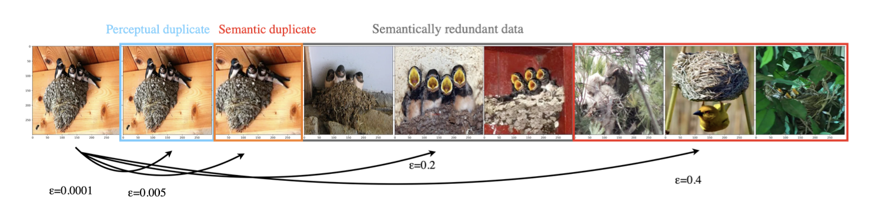
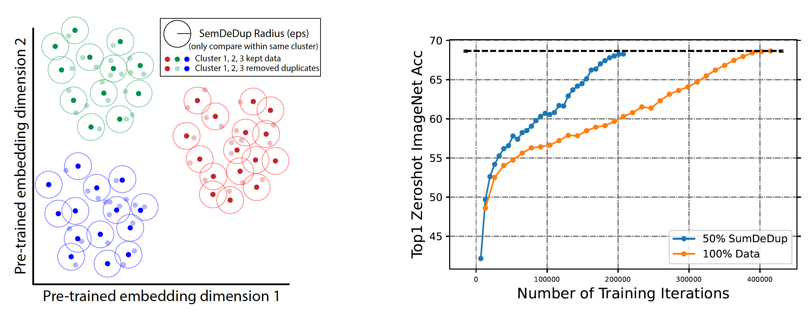

# SemDeDup: Data-Efficient Learning at Web-scale through semantic deduplication

Code for "SemDeDup", a simple method for identifying and removing “semantic duplicates”: data pairs which are semantically similar, but not exactly identical. Removing semantic duplicates preserves performance and speeds up learning - for more information please see our paper  <a href="https://arxiv.org/abs/2303.09540"> here </a>.

<p align="center">
  
</p>

## Setup

We recommend using conda to install semdedup. For easy install, use `semdedup_conda_env.yml` to create the conda environment:

```
 conda env create -n semdedup --file semdedup_conda_env.yml 
 conda activate semdedup
```

and you should be good to go!

<p align="center">
  
</p>

## Running the pipeline

### 1) Run get_embeddings(.) to compute and store embeddings from a pretrained model.

 Template code:
```python
from compute_pretrained_embeddings import get_embeddings

model = ...
dataloader = ...

path_str_type = ...
emb_memory_loc = ...
paths_memory_loc = ...
dataset_size = ...
emb_size = ...
emb_array = np.memmap(emb_memory_loc, dtype='float32', mode='w+', shape=(dataset_size, emb_size))
path_array = np.memmap(emb_memory_loc, dtype=path_str_type, mode='w+', shape=(dataset_size,))

get_embeddings(model, dataloader, emd_memmap, paths_memmap)

```

Argument descriptions: 
```
dataloader: should return the following
1) data_batch: batch of data examples
2) paths_batch: path to location where the example is stored (unique identifier). For example, this could be "n04235860_14959.JPEG" for imagenet. 
3) batch_indices: global index for each example (between 0 and of size <dataset_size>-1).

emd_memmap: numpy memmap to store embeddings of size <dataset_size>.

paths_memmap: numpy memmap to store paths of size <dataset_size>.
```

### 2) Run K-Means clustering on embeddings from step (1)

from ```clustering``` run the following script
and don't forget to modify the config file ```/configs/openclip/clustering_configs.yaml``` first!
```python
python compute_centroids.py --confg-file "/configs/openclip/clustering_configs.yaml" \
                            --partition <partition> \
                            --ngpus 1 \
                            --cpus-per-task 10 \
                            --timeout 300 \ 
```
The script will submit a job using ```submitit```. Alternatively, you can use the following python code:<br>
Template code:
```python
import yaml
import random
import numpy as np
import logging
from clustering.clustering import compute_centroids


logger = logging.getLogger(__name__) 
logger.addHandler(logging.StreamHandler())

confg_file = "configs/openclip/clustering_configs.yaml"
## -- Load kmeans clustering parameters from configs file
with open(confg_file, 'r') as y_file:
    params = yaml.load(y_file, Loader=yaml.FullLoader)

## -- Fix the seed
SEED = params['seed']
random.seed(SEED)
emb_memory_loc = params['emb_memory_loc'] 
paths_memory_loc = params['paths_memory_loc'] 
dataset_size = params['dataset_size'] 
emb_size = params['emb_size'] 
path_str_type = params['path_str_type']

emb_memory = np.memmap(emb_memory_loc, dtype='float32', mode='r', shape=(dataset_size, emb_size))
paths_memory = np.memmap(paths_memory_loc, dtype=path_str_type, mode='r', shape=(dataset_size,))

compute_centroids(
    data=emb_memory,
    ncentroids=params['ncentroids'],
    niter=params['niter'],
    seed=params['seed'],
    Kmeans_with_cos_dist=params['Kmeans_with_cos_dist'],
    save_folder=params['save_folder'],
    logger=logger,
    verbose=True,
)
```

Argument descriptions:
```
    seed: random seed to run pipeline with (this does not affect results since semdedup is deterministic)

    emb_memory_loc: path to numpy memmap file that stores embeddings of size <dataset_size>

    paths_memory_loc: path to numpy memmap file that store paths of size <dataset_size>

    dataset_size: total size of the dataset that semdedup is running on

    emb_size: size of the embeddings computed in step (1)
```

### 3) Sort Clusters
from ```clustering``` run the following script
and don't forget to modify the config file ```/configs/openclip/clustering_configs.yaml``` first!
```python
python sort_clusters.py --confg-file "/configs/openclip/clustering_configs.yaml" \
                            --partition <partition> \
                            --num-tasks 10 \
                            --cpus-per-task 5 \
                            --timeout 300 \ 
```
The script will submit a job using ```submitit```. Alternatively, you can use the following python code:<br>
Template code:
```python
from sort_clusters import assign_and_sort_clusters

assign_and_sort_clusters(
    data=emb_memory,
    paths_list=paths_memory,
    sim_metric=params["sim_metric"],
    keep_hard=params["keep_hard"],
    kmeans_with_cos_dist=params["kmeans_with_cos_dist"],
    save_folder=params["save_folder"],
    sorted_clusters_file_loc=params["sorted_clusters_file_loc"],
    cluster_ids=range(0, params["ncentroids"]),
    logger=logger,
) 
```
### 4) Run SemDeDup
Run the following script and don't forget to modify the config file ```semdedup_configs.yaml``` first!
The script uses ```submitit``` to launch jobs on N nodes. Each nodes will process parts of the clusters. We then initiate <tasks-per-node> tasks on every node to increase parallelization and improve speed.
```
python submit_semdedup_job.py  --config-file "semdedup_configs.yaml" \
                               --eps-list <eps-list> \ 
                               --partition <partition> \
                               --nodes 8 \
                               --tasks-per-node 20 \
                               --cpus-per-task 4 \
```

Argument descriptions: 
```
  --config-file: configuration file.

  --eps-list: list of epsilons to run semdedup with (lower epsilon will cause more agressive pruning, see https://arxiv.org/abs/2303.09540 for more details)

  --tasks-per-node: we initiate <tasks-per-node> tasks on every node to increase parallelization and improve speed.

  --cpus-per-task: number of cpus for each task.
```


### 5) Extract deduplicated data as paths to examples locations

Template code:
```python
from extract_dedup_data import extract_pruned_data

output_txt_path = ...
semdedup_pruning_tables_path = ...
sorted_clusters_path = ...
eps = ...
num_clusters = ...
extract_pruned_data(sorted_clusters_path, semdedup_pruning_tables_path, eps, num_clusters, output_txt_path, retreive_kept_samples=True)
```

Argument descriptions:

```
sorted_clusters_path: path to the sorted clusters files (this is the output of step (3) above).

semdedup_dataframes_path: path to saved semdedup (this is the output of step (3) above).

eps: single value of epsilon used for running semdedup run in step (3).

num_clusters: number of clusters that k-means clustering was run with.

output_txt_path: output txt file which contains the paths to examples that are kept after running semdedup [paths are retrieved from `path_array` from step (1)].
```

## Citation

If you use this codebase, please make sure to cite our paper:
```
@article{abbas2023semdedup,
  title={SemDeDup: Data-efficient learning at web-scale through semantic deduplication},
  author={Abbas, Amro and Tirumala, Kushal and Simig, D{\'a}niel and Ganguli, Surya and Morcos, Ari S},
  journal={arXiv preprint arXiv:2303.09540},
  year={2023}
}
```

## License
Please see the License file [here](LICENSE).